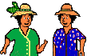

<!-- href="http://www.guetali.fr/home/cmary/index.htm" -->

  Donc, voici **la Balise des Mary** (*aujourd’hui disparu*) qui se voulait être un phare qui éclaire la Réunion pour les curieux que vous êtes, vous qui venez (souvent) visiter ma page. Il y a un remarquable trombinoscope réunionnais, une présentation de quelques oiseaux de l’île et une foultitude de liens que vous retrouverez [peut-être ici](/liens/) , sur mon site un autre jour.{.chapo}

  Outre le texte, les dessins ne manquent pas non plus. Les Mary, hébergés chez <a href="/decouverte/economie/acces-internet-histoire/">Guetali</a>, proposent des petits gifs animés sur le thème de la Réunion.

## Les gif animés

{.right}
*Je me suis souvent servi des gifs des Mary pour illustrer mes pages au début et puis les gifs animés étant passés de mode, je les ai oubliés. J’en ai même perdu certains. Cette page était avant illustrée d’une cascade comme la Réunion en offre de jolies ( comme par exemple **le voile de la mariée** ) mais j’ai perdu ce gif dans un déménagement et maintenant la balise des Mary n’éclaire plus le web réunionnais. Il me reste encore le « [ladilafé](/decouverte/mots-creoles/ladilafe/) » (ci-dessus) celui qui vous permet d’en discuter.*
