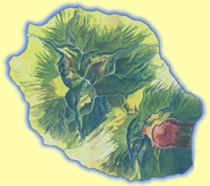

#### Plusieurs cartes de la Réunion vous permettent de comprendre mieux ce petit bout de France dans l'Océan Indien. Ces cartes utilisent la même base dessinée en 2000 à partir d'un dépliant touristique. Elles ont servi de référence depuis lors à chaque fois qu'[un article](/articles) nécéssitait de prendre de la hauteur pour vous montrer l'ensemble de l'île.

<!-- TODO : divisiona -->
