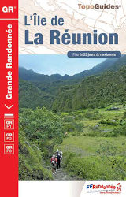
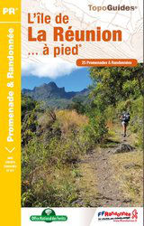
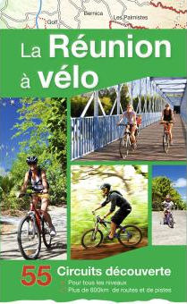

Ne sont présentés ici que les chemins de grande randonnée. La Réunion offre plein d'autres circuits qu'il n'est pas possible de montrer sur une si petite image.{.chapo}

: le GR 1 ( variantes en pointillés )
: le GR 2 ( variantes en pointillés )

  

## Les topoguides

### Topoguide de Grande Randonnée

  {.left}
  **Topoguide**
  GR R1, GR R2 et GR R3
  Federation Francaise De Randonnee Pedestre 
  Collection Grande Randonnee 
  Format 13cm x 21cm 
  

<h3> L'île de La Réunion à pied</h3>

  {.left}
  **Topoguide**
  25 balades et randonnées réparties sur l'ensemble de l'île
  Federation Francaise De Randonnee Pedestre 
  Collection PR
  Format 13cm x 21cm
  

  {.left} *Le seul livre à la Réunion qui vous propose un guide pratique cyclo-sportif et cyclo-touristique.*
  
  **La Réunion à vélo, 55 circuits découverte**
  Austral éditions
  128 pages
  

