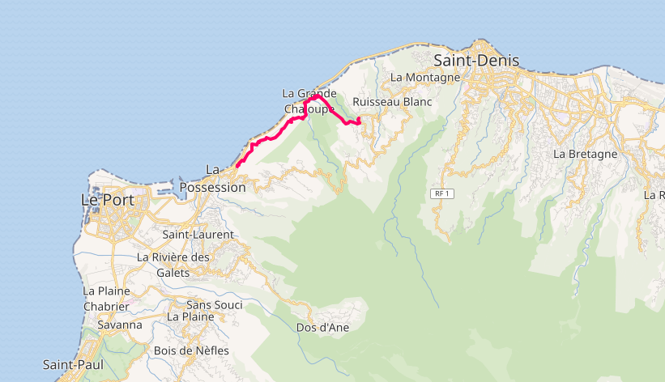
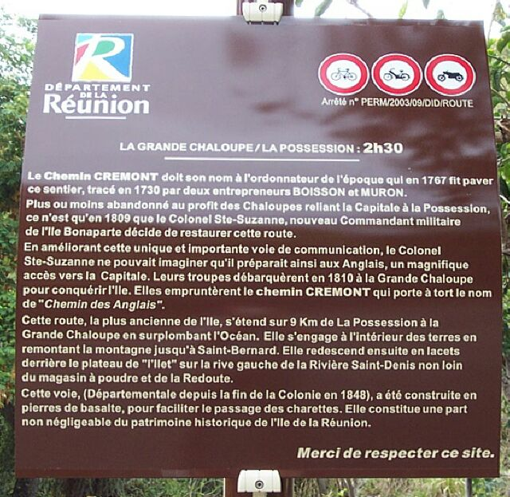

## Histoire du chemin Crémont

Le **Chemin Crémont**, appelé communément et à tort le **Chemin des Anglais** au départ de la Possession débouche à la Grande Chaloupe après une heure et demie environ de marche. Ce chemin pavé de dalles de basalte d'une longueur de 8 km environ, longe le haut de la falaise et surplombe l'océan. Cette route est la plus ancienne de l'île, les travaux ont été réalisés entre 1730 et 1732 par deux entreprenneurs Boisson et Muron.

En 1767, par l'ordonnateur Crémont fit paver cette route afin d'assurer une liaison à travers le massif de la montagne, entre Saint-Denis et la Possession. C'est ainsi que le chemin prendra son nom. Le chemin se prolonge ensuite vers Saint-Denis à partir de la Grande Chaloupe.

 

    
   Aspects du chemin des Anglais entre La Possession et La Grande Chaloupe, 6 mai 2015 par Chaoborus (<a href="https://commons.wikimedia.org/wiki/File:Chemin_des_Anglais-mai_2015_02.jpg">CC-BY-SA</a>)
 

Plus ou moins abandonné au profit du transport par chaloupe en mer, le chemin est restauré en 1809 par le colonel Sainte Suzanne, commandant militaire de l'[île Bonaparte](/decouverte/histoire/noms-ile/#:~:text=Île Bonaparte)

## Les Anglais prennent le chemin puis l'île

En 1810 débarquent les troupes Anglaises, en guerre contre la France dans [les guerres napoléoniennes](/decouverte/histoire/guerre-anglais/) débarquent à la Chalouppe d'où ils marchent vers la capitale Saint-Denis afin de la conquérir. Depuis cet évènement, le nom de Chemin des Anglais désigne la totalité du chemin.

En 1948, le chemin devient la propriété du département de la Réunion et il est [classé aux monuments historiques](https://museedupatrimoine.fr/chemin-dit-des-anglais/58565.html) en 2014. Le chemin est classé en totalité, d'une longueur de onze kilomètres depuis la barrière située à Saint-Bernard jusqu'à celle de La Possession, à l'exclusion de l'emprise située entre les deux accès du chemin à la Grande-Chaloupe. À cet endroit, les sites classés somt [les deux lazarets de la Grande-Chaloupe](/decouverte/histoire/lazarets-grande-chaloupe/) qui ont été errigés en 1860.

## Un chemin prisé des randonneurs

Ce chemin est facillement accessible du centre de la Possession et offre une belle vue et permet de fouller du pied le patrimoine de la Réunion. Le chemin faisant 9km de long, on peut compter 18km aller-retour depuis la Possession, soit une randonnée de 3 heures.

Pas de grande difficulté pour cette balade, vous pourrez admirer le point de vue, d'un côté sur la Possession et le Port, de l'autre  la Grande Chaloupe, sans oublier la découverte de la vielle route et la vue sur l'océan. Prenez le temps une fois arrivé à la Grande Chaloupe de visiter les ruines des lazarets et la gare du petit train.

Le chemin des Anglais a donné son nom au **Trail des Anglais**, un trail court de 27 km de longueur et de 1 500 m de dénivelé positif. Le départ a lieu au Port sur l'île de La Réunion et l'arrivée est jugée sur le stade de la Redoute à Saint-Denis. Une grande partie de l'épreuve se déroule sur le chemin des Anglais.

<!---

  photos: https://commons.wikimedia.org/wiki/Category:Chemin_Cr%C3%A9mont

  
carte à la Chaloupe https://fr.wikipedia.org/wiki/Lazarets_de_la_Grande-Chaloupe#/media/Fichier:GrandeChaloupe.vers.1900.jpg

https://fr.wikipedia.org/wiki/Chemin_Cr%C3%A9mont
https://fr.wikipedia.org/wiki/Trail_des_Anglais

https://web.archive.org/web/20080803110657/http://www.mi-aime-a-ou.com/randonnee_chemin_des_anglais_ile_reunion.htm

https://web.archive.org/web/20080920085044/http://www.mi-aime-a-ou.com/photos_ile_reunion/disp1_img.php?id_img=986
https://web.archive.org/web/20090402155503/http://www.mi-aime-a-ou.com/photos_ile_reunion/disp1_img.php?id_img=985
https://web.archive.org/web/20080920085431/http://www.mi-aime-a-ou.com/photos_ile_reunion/disp1_img.php?id_img=983

--->