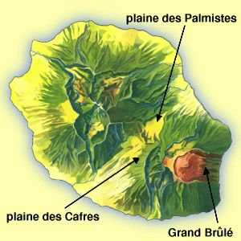

{.center}

## L'île au vent

La partie orientale de l'île est dite « au vent » puisqu'elle est directement exposée aux éléments du ciel qui viennent toujours du nord-est (c'est la direction des vents dominants à cette latitude). Le climat donne une <b>végétation tropicale luxuriante</b> et permet entre-autres, <a href="/decouverte/economie/vanille-bourbon/">la culture de la vanille</a>.

## Le Piton de la fournaise
C'est aussi la partie la plus récente de l'île puisque <b><a href="/decouverte/geographie/volcan/">le Piton de la Fournaise</a></b>,  le volcan encore <a href="/la-fournaise-se-reveille/">en activitée</a>, modèle encore régulièrement la côte par des coulées de lave spectaculaires. Quand ce site a commencé, le volcan était plutôt calme, la dernière coulée ayant rejoint la mer datait de plus de dix ans (1986). Cette année là, l'île avait gagné 30 km²! Depuis, les éruptions du début des années 2000 m'ont permis de couvrir encore mieux le <a href="/acceleration-de-la-fonte-des-neiges-sur-le-piton-de-la-fournaise/">spectacle de la lave et de l'eau</a>.

Le Piton de la fournaise est vieux de 400.000 ans ce qui est jeune pour un volcan et c'est pour ça  qu'il n'a pas été retrenu pour le casting de la publicité Volvic. Le flanc oriental du Piton de la Fournaise est l'endroit où le magma est peu profond
  et les éruptions se produisent dans cette zone non-constructible qu'on appelle l'enclos.

Coté  ouest, le volcan est bordé par la <a href="/decouverte/geographie/plaine-palmistes/">plaine des palmistes</a> sur le flanc nord et la <a href="/decouverte/geographie/plaine-cafres/">plaine des cafres</a> sur le flanc sud. Ces deux plateaux portent les noms de ce qui fait la richesse de l'île: <a href="/decouverte/nature/palmiste/">les palmistes</a> sont des arbres et les cafres sont des habitants originaires du continent africain.

### Pour en savoir plus
<ul>
<li><a href="/decouverte/geographie/plaine-cafres/">La plaine des Cafres</a></li>
<li><a href="/decouverte/geographie/plaine-palmistes/">La plaine des Palmistes</a></li>
<li><a href="/decouverte/geographie/ouest-ile/">La partie ouest de l'île</a></li>
<li><a href="/decouverte/geographie/cartes/divisions/">Comment diviser la Réunion</a> (si on ne la sépare pas en est/ouest)</li>
</ul>

### Cartes de l'île de la Réunion
<ul>
<li><a href="/decouverte/geographie/cartes/grande/">Grande carte de l'île</a></li>
<li><a href="/decouverte/geographie/cartes/communes/">Carte des communes de la Réunion</a></li>
<li><a href="/decouverte/geographie/cartes/grande/">Carte routière</a></li>
<li><a href="/decouverte/histoire/decouverte/">Carte de l'île Bourbon dressée en 1645</a></li>
<li><a href="/decouverte/geographie/cartes/grande/">Carte des chemins de randonnée</a></li>
<li><a href="/decouverte/revues/cartes-ign/">Toutes les cartes IGN de la Réunion</a></li>
</ul>
