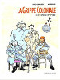
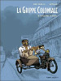
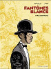
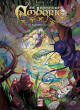
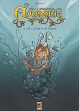
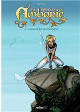
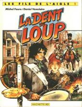
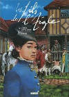
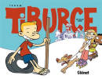
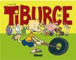

Petite sélection non exhaustive de bandes dessinées sur la Réunion ou par des réunionnais.{.chapo}

## La grippe coloniale

Dyptique historique relattant l'après première guerre mondiale et l'arrivée de la grippe espagnole sur l'île de la Réunion. Cette BD primée à Angoulème dépeint la société de cette colonie à l'aube du XXème siècle.

<b>Article dédié :</b> <a href="/la-grande-guerre-prend-la-reunion-en-grippe/">La Grande guerre prend la Réunion en grippe</a>.

### Le retour d'Ulysse

{.left}
    La grippe coloniale , Tome 1 
    Bande dessinée | cartonné | Vents D'ouest | octobre 2003 
    

### Cyclone la peste

{.left}
    La grippe coloniale , Tome 2 
    Bande dessinée | cartonné | Vents D'ouest | juin 2012 
    

## Les fantômes blancs

Cette histoire en deux tomes peint la Réunion de la fin du XIXème siècle ou les progrěs sociologiques et technologiques s'entremèlent avec les souvenirs et l'histoire des ancètres et leurs espris (les fantômes blancs). Une histoire par l'auteur de la grippe coloniale, avec un autre ami dessinateur qui met en valeur les traits captivants de la Réunion comme les trésors pirates et les relans amers de l'esclavage.

### Maison Rouge

{.left}
    Les fantômes blancs , Tome 1 
    Bande dessinée | cartonné | Vents D'ouest | août 2005 
    

### Bénedicte

    {.left}
    Les fantômes blancs , Tome 2 
    Bande dessinée | cartonné | Vents D'ouest | octobre 2006 
    

## Six Runkels en Amborie

Dans un tout autre registre, <b>Shovel</b> propose des aventures de Jean-Michel, Doquiane et Brib dans le monde fantastique et souterrain d'Amborie. Un récit d'heroic fantasy plein d'humour en trois albums.

<b>Article dédié :</b> <a href="/la-reunion-underground-a-livre-ouvert/">La Réunion underground à livre ouvert</a>.

### Un bracelet d’Agliffe

{.left}
Six Runkels en Amborie - Tome 01 
Bande dessinée | cartonné | Epsilon BD | avril 2007 
    <i>Jean-Michel, Doquiane et Brib escortés par le hazel, atteignent la porte du Lem-Mhy et le village naïul. Jean-Michel se voit offrir un bracelet aux pouvoirs magiques avant leur rencontre avec maître Jean…</i> 
    

### Un collier pour parler

{.left}
    Six Runkels en Amborie - Tome 02 
    Bande dessinée | cartonné | Epsilon BD | janvier 2009 
    <i>Jean Michel, devenu maître Jean depuis son passage en Amborie, poursuit sa lutte contre Havorn en compagnie de Brib, Doquiane et du hazel, tout en cherchant un moyen de rejoindre son monde.</i> 
    

### L’amour de mon ennemi

{.left}
    Six Runkels en Amborie - Tome 03 
    Bande dessinée | cartonné | Epsilon BD | janvier 2009 
    <i>« On peut invoquer des légions entières, déplacer des mondes, créer des espèces et les dominer ! Bref, c’est un chouette bouquin ! »</i> 
    

## Les fils de l'aigle

Les Fils de l’aigle est une série de bande dessinée qui se déroule dans toute l'Europe, après le premier empire. <a href="/daniel-vaxelaire-ecrit-pour-les-enfants/">Daniel Vaxelaire en est le scénariste</a> et le dessin est signé Michel Faure. Édité tour à tour par Hachette, Les Humanoïdes Associés, Arboris puis Theloma cette saga s'étale sur 10 albums parus entre 1985 et 1998.

<ul>
  <li><a href="/decouverte/revues/livres-vaxelaire-enfants/">D'autres livres jeunesse de Daniel Vaxelaire</a></li>
  <li>Article dédié à cet auteur : <a href="/daniel-vaxelaire-ecrit-pour-les-enfants/">Daniel Vaxelaire écrit pour les enfants</a></li>
</ul>

L'éditeur Theloma a fait parraître une réédition en 2007 que l'on peut encore trouver dans les boutiques sur fnac.com

{.left} {.left} {.left}
  

## Tiburce

Tiburce est un petit gamin réunionnais des hauts né à la grande époque du Margouillat. Le monde qui l'entoure est peuplé de stéréothypes réunionnais qui surprend sa voisine zoreille Salomé et fait rire les lecteurs à chaque strip.

Les premières apparition de Tiburce ont lieu dans le Cri du Margouillat en 1996. Les strips ont ensuite été publiées dans la colection Bichick, aux éditions Le Centre du Monde entre 1996 et 2002. Tehem a ensuite rejoint l'éditeur Glénat où il a rencontré le succès avec les séries Malika Secouss et Zap collège. Tiburce y a fait son retour avec deux albums de strips ou le gamin continue ses frasques.

<ul>
  <li>Lire aussi : <a href="/le-margouillat-fait-des-bulles/">Le Margouillat fait des bulles</a></li>
</ul>

### Soleil Zoreil

{.left}
    Soleil Zoreil , Tiburce Tome 1 
    Bande dessinée | Glénat | novembre 2010  
    

### En roue libre

{.left}
    En roue libre , Tiburce Tome 2 
    Bande dessinée | Glénat | février 2012  
    

