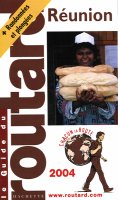
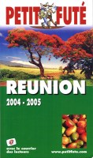
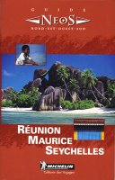
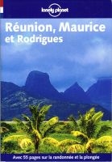

En 2004, j'ai écrit aux éditeurs de guides pour leur proposer de m'envoyer leurs ouvrages. Parmi ceux que j'ai reçu, je vous en présente quelques-uns qui me semblent bien faits et s'adressent à des publics différents.{.chapo}

La plupart des éditeurs réactualisent leur guide tous les ans ou tous les deux ans, les auteurs et ce qui est proposé le long de leurs pages ne change pas aussi vite. Cette liste bien qu'ancienne peut donc toujours vous aider à préparer un voyage.{.chapo}

## le Guide du routard Réunion
{.left} 
Il me semble que c'est le guide le plus riche en adresses pour dormir et manger. Il détaille bien les différentes sorties possibles et là aussi semble le plus conplet. Ce guide me semble aussi le mieux organisé et il est en tout cas plus clair que le petit futé, pour le comparer à un niveau de prix équivalent.

Depuis quelques années le Routard ajoute les randonnées et plongées sur sa couverture. Les plans les plus courrus étaient déjà dans le guide avant et là aussi semble complet mais le routard ne remplacera quand même pas <a href="/decouverte/geographie/cartes/randonnee/">un topoguide</a>.


<ul>
<li><a href="/guides-de-tourisme-et-de-randonnee/">Article sur les guides de tourisme</a></li>
<li><a href="/decouverte/revues/cartes-ign/">6 cartes de randonnée et une carte routière pour la Réunion</a></li>
</ul>

## Le petit futé RÉUNION
{.left} 
Les habitués du petit futé connaissent bien la foule de renseignements qu'on peut y trouver. Ce pavé, parsemé de publicités ciblées semble être bien complet mais il faudrait sûrement faire le tri dans les informations. Les remarques des lecteurs sont intégrées à la suite des articles sans les modifier ce qui donne un curieux mélange. Après une carte d'identité détaillée de l'île, les différentes régions sont présentées avec propositions de circuits et bonnes adresses. Les photos couleurs de Serge Gelabert et Claude Wambeck agrémentent les pages.

Ce livre est trop épais pour tenir dans la poche mais une une version numérique est aussi fournie avec le livre.


## Guide Michelin RÉUNION MAURICE RODRIGUES
{.left} 
Ce guide est très complet et joliement présenté pour découvrir la Réunion. Il convient aussi bien au touriste qui cherche des idées d'excursion qu'aux curieux qui veulent découvrir l'océan Indien. Les cartes sont les plus claires et détaillées que j'ai pu voir. C'est la moindre des choses quand on sort de chez l'éditeur Michelin.

*Dommage que ce même éditeur a décidé de mettre fin à la collection NEOS. En échange le guide vert sur la Réunion est sorti dans les années 2010 ce qui remet sur le marché un guide avec des cartes précises au moment où tout le monde s'oriente avec son téléphone. Le guide vert Michelin n'en reste pas moins un bon choix pour qui ne veut pas plétore de choix mais des explications détaillées.*

Ah ! et aussi, Michelin a enfin sorti un guide vert sur la Réunion


*À noter que michelin de fait pas de revue des hotels et des bonnes tables de la Réunion. Il n'y a pas de restaurant étoilé à la Réunionsimplement parce que Michelin ne les cherche pas. Pour cela, il faudra se tourner vers <a href="/la-reunion-gastronomique/">le guide Kaspro</a>.*

## Lonely Planet Réunion Maurice et Rodrigues
{.left} 
Cet éditeur australien publie ses guides en langue française depuis quelques années déjà. Claire et pratique, cette collection est la référence internationale pour les <i>backpackers</i>. Les activités comme la plongée et la randonnée en sont le point fort de ce guide.

<b>Depuis 2012, il existe un Lonely Planet pour la Réunion uniquement</b>. Pas mal d'autres activités de plein air sont listées comme le parapente ou le rafting. La dernière édition date de 2022.


Si vous préparez un voyage dans toutes les mascareignes, je ne saurais que vous conseiller une ancienne édition avec les trois îles: Réunion, Maurice, Rodrigues.


## Lisez aussi

<ul>
<li><a href="/guides-de-tourisme-et-de-randonnee/">Article sur les guides de tourisme</a></li>
<li><a href="/decouverte/revues/cartes-ign/">6 cartes de randonnée</a></li>
<li><a href="/decouverte/geographie/cartes/randonnee/">Chemins de randonnée et Topoguides</a></li>
</ul>
